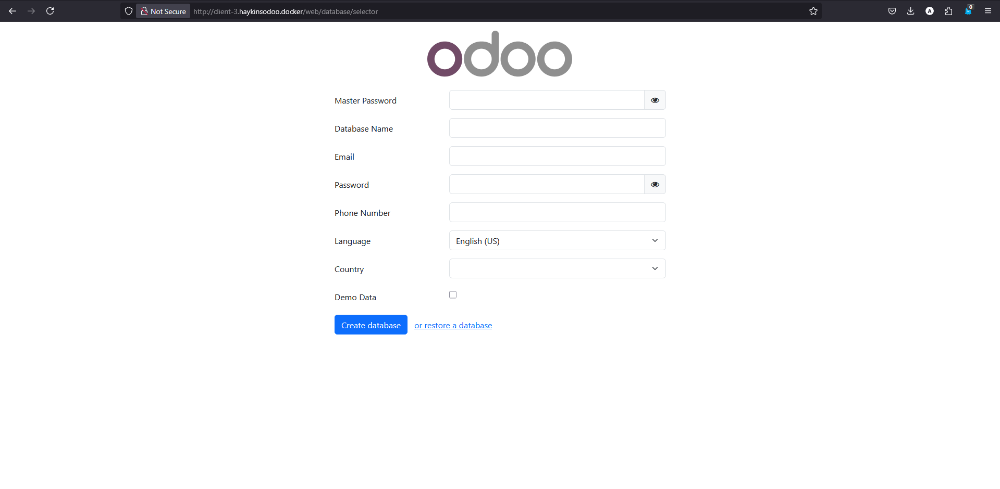
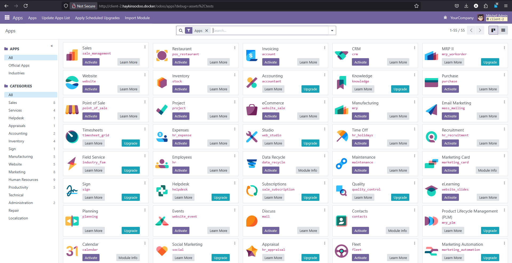
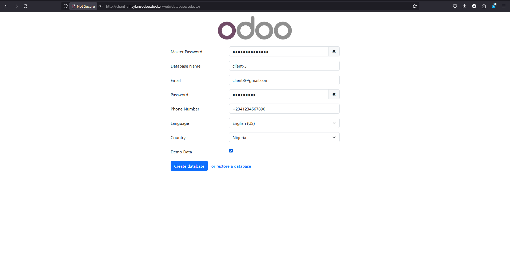

# A Multi-Tenant Odoo 18 App



## Summary

How to configure multiple databases on individual domain names using a single Odoo instance? [View Full Article here](https://dev.to/thisishaykins/how-to-configure-multiple-databases-on-individual-domain-names-using-a-single-odoo-instance-3ppp)

Whether you’re a developer, startup founder, or building the next ERP-as-a-Service, this is your kick-off point. With this setup, you're running your own multi-tenant app on Odoo 18.

## Project Structure

```
├── docker-compose.yml
├── .env
├── odoo.conf
└── traefik/
    ├── traefik.yml
    └── acme.json
```

## Project Setup

### > Add host entries on ``/etc/hosts`` (or Windows equivalent)

```bash
127.0.0.1 client-1.haykinsodoo.docker client-2.haykinsodoo.docker client-3.haykinsodoo.docker
```

### > Startup the project using docker

```bash
# Start services
$ docker-compose up 
# === OR ====
$ docker-compose up --build
```

### > Visit the following link on your browser

- <http://client-1.haykinsodoo.docker/> **(note: ensure to copy the master password which will be re-used for all other clients installations)**
- http://client-2.haykinsodoo.docker/
- http://client-3.haykinsodoo.docker/


### > 🤖 Bonus: Manually Create DB
```bash
$ docker exec -it <odoo_container_id> /bin/bash

$ odoo -d client-1 --init=base --stop-after-init
```

## Project App Screenshots

### Client 1 App Interface


### Client 2 App Interface



### Client 3 App Interface




---

Developed By: Akinshola Samuel AKINDE (<akinsholasamuel@gmail.com>)
